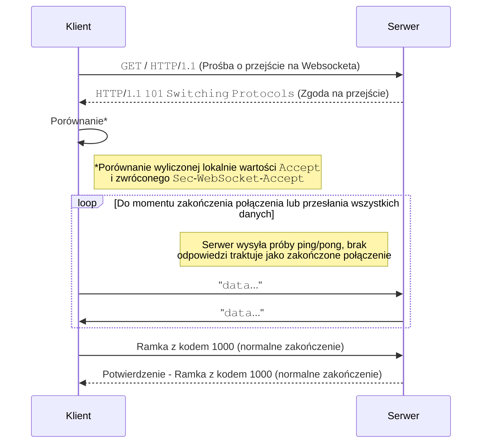
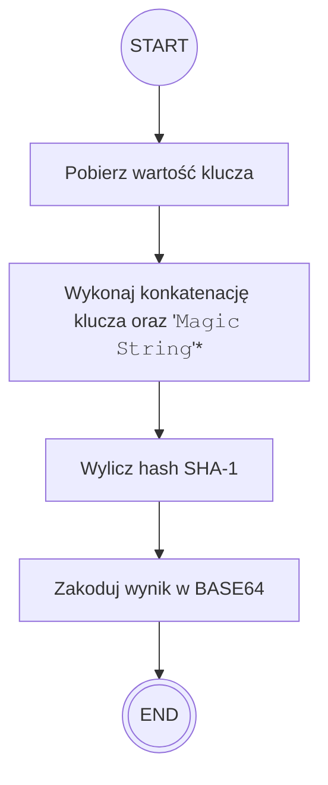

### Wstępne notatki
1. Jest to rodzaj połączenia między dwoma urządzeniami, który polega na tym, że wykonuje się, bez timeout'owania i bez limitów wiadomości wiele wymian danych, dlatego jest to idealne w przypadku Real Life Data czy różnych aplikacji, które potrzebują update'ów na żywo, jak na przykład aplikacje do kolaboracji albo gry. 
### Diagram działania protokołu


> Ważna informacja jest taka, że po przejściu na protokół WebSocket, **wiadomości mogą być wysyłane z obu stron**. Nie wymagają żadnego potwierdzenia; komunikacja jest po prostu dowolna

### Przykładowy Handshake
Request:
```http
GET /chat HTTP/1.1
Host: server.example.com
Upgrade: websocket
Connection: Upgrade
Sec-WebSocket-Key: dGhlIHNhbXBsZSBub25jZQ==
Origin: http://example.com
Sec-WebSocket-Protocol: chat, superchat
Sec-WebSocket-Version: 13
```

Response:
```http
HTTP/1.1 101 Switching Protocols
Upgrade: websocket
Connection: Upgrade
Sec-WebSocket-Accept: s3pPLMBiTxaQ9kYGzzhZRbK+xOo=
Sec-WebSocket-Protocol: chat
```

Wytłumaczenie pól:
- `Sec-WebSocket-Key`: Losowo wygenerowany ciąg znaków
- `Sec-WebSocket-Protocol`: Oczekiwany protokół wymiany wiadomości. Nie ma konkretnego zestawu protokołów. Przykładowe to: `chat`, `superchat`, `graphql-ws`, `mqtt`, `xmpp`, `v10.stomp` czy inne własne nazwy.
	- Serwer wybiera pierwszy akceptowany protokół - liczy się kolejność
	- W przypadku, gdy serwer nie wspiera żadnego protokołu, nie zwraca w ogóle wartości `Sec-WebSocket-Protocol`
	- Serwer może wspierać więcej niż jeden protokół, np. dla endpointa `/chat`, jeżeli klient zażąda protokołu `text`, będzie otrzymywać wiadomości w zwykłym tekście, a dla protokołu `html`, będzie otrzymywać gotowe do wyświetlenia elementy HTML
- `Sec-WebSocket-Version`: Oczekiwana wersja protokołu WebSocket
- `Sec-WebSocket-Accept`: Potwierdzenie klucza. Wartość wyliczana po stronie serwera (konkatenacja statycznego stringu, hashowanie [[SHA-1]], kodowanie [[BASE64]]) a następnie zwracana.
#### Algorytm wyliczania wartości `Accept`


> * Wartość `Magic String` to wartość zdefiniowana w protokole WebSocket i ma wartość `258EAFA5-E914-47DA-95CA-C5AB0DC85B11`. Oznacza to że niezależnie od środowiska serwera (języka programowania, systemu operacyjnego, frameworka) wartość `Magic String` będzie identyczna, a co za tym idzie, wyliczona wartość `Accept` będzie taka sama. 
#### Konieczność wartości `Key` i `Accept`
1. **Ochrona przed serwerami cache (proxy)**: Załóżmy, że zapytanie klienta trafia na serwer buforujący u dostawcy internetu. Gdyby nie było nagłówka `Sec-WebSocket-Key`, proxy mogłoby uznać to za zwykłe zapytanie HTTP i odesłać z pamięci podręcznej starą odpowiedź, nie nawiązując fizycznego połączenia. Unikalny, losowy klucz wymusza na infrastrukturze sieciowej przekazanie żądania do właściwego serwera.
2. **Weryfikacja adresata**: Jeśli omyłkowo skierujesz żądanie WebSocket do zwykłego serwera HTTP (np. serwującego statyczne obrazy), ten nie będzie znał algorytmu i nie odeśle poprawnego `Sec-WebSocket-Accept`. Klient natychmiast odrzuci takie połączenie, co uchroni aplikację przed zawieszeniem się w oczekiwaniu na nieprawidłowe dane.
